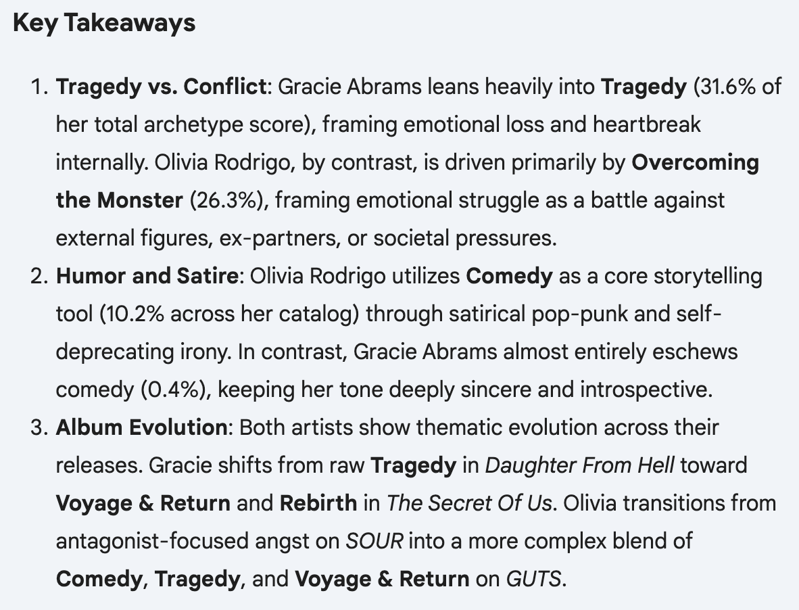

# Classifying Songs By Plot Archetypes Using Logistic Regression

I use binary classification and multinomial softmax models to classify songs by artist (Olivia Rodrigo or Gracie Abrams) and album. For the binary classifier (the basic logistic regression model), features strong positive coefficients define Gracie Abrams' style, and vice versa. In the multinomial softmax model, all albums are compared against "SOUR" by Olivia Rodrigo, and positive coefficients mean that if a feature is observed more in a song, it is less likely to be from SOUR (and vice versa). The features in this data are how well each song fits each of the seven basic plot archetypes. 

[Quick comment on results]

For future work, I will try to use a K-Means classifier on a larger dataset of songs from more artists to see which artists like to write which kinds of songs. Each cluster will be interpretable based on the seven basic plot archetypes, and I will analyze how many songs from each artist are in each cluster. 

---

## Experimental Design

This experiment consists of two phases. Phase one is a binary classification of the songs by artist (0 = Olivia Rodrigo, 1 = Gracie Abrams). Here is the equation:
```math
P(y=1 \mid x) = \sigma(w^T x + b) = \frac{1}{1 + e^{-(w^T x + b)}}
```
\
The feature vector w has seven dimensions, each corresponding to a rating of how well the song fits one of the seven plot archetypes (explained in further detail below). These features are transformed to follow a standard normal distribution so we can compare the coefficients stored in w. The goal is to find the specific features that are the most helpful in classifying each artist. The magnitude of each coefficient is a proxy for explanatory power, and a negative sign indicates that feature best describes lyrics by Olivia Rodrigo (and positive indicates Gracie Abrams).  

Phase two complicates this model by breaking down the classes into the six albums reviewed in the dataset. Thus, we will get six different sets of coefficients: 
```math
P(y = k \mid \mathbf{x}) = \frac{e^{\mathbf{w}_k^T \mathbf{x} + b_k}}{\sum_{j=1}^{6} e^{\mathbf{w}_j^T \mathbf{x} + b_j}}
```
\
In this case, positive coefficients mean the presence of that feature makes it more likely that a song belongs to that class. This makes the raw numbers harder to interpret. I will have to compare the values of the features for all six sets of coefficients, looking for the highest positive coefficients to mean the song has the best chance of being in that album. Still, that chance could very well be less than 50%, and some albums might be very similar in terms of the archetypes involved, so this might be tricky to interpret. 

---

## Explanation of Raw Data

The dataset, artist_comparison.xlsx, contains 90 songs (41 by Olivia Rodrigo, and 49) by Gracie Abrams. The albums included are SOUR, GUTS, You Seem Pretty Sad For A Girl So In Love, Good Riddance, The Secret Of Us, and Daughter From Hell. Each observation has the song name, an artist label, album label, and scores of fit to each of the seven basic plot archetypes. An explanation of the scoring system I used is included in "rating_specification" sheet, and also here:

### The Seven Basic Plot Structures
1) Overcoming the Monster
This applies to songs where the speaker battles an external villain, most commonly their ex or some facet of social norms / society. A perfect fit (score 3/3) has the speaker overcome the villain in addition to venting about them. 

2) Rags to Riches
In the context of a song, rags to riches refers to a story of the speaker experiencing a period of good fortune that helps them overcome some form of external adversity (any proxy for poverty, for instance). A perfect fit includes a marked change in the speaker's worldview after experiencing 'riches'.

3) The Quest
A quest refers to a journey that is deliberately undertaken with the goal of finding something specific, whether that's a material treasure or a feeling. A perfect fit focuses on how the journey changes the speaker.

4) Voyage and Return
By contrast, a voyage and return is more of an accidental or life experience journey that had no specific aim. A perfect fit focuses on how undertaking and returning from the journey inspired the speaker to make some change in their life. 

5) Comedy
This is one of the more self-explanatory and clear-cut archetypes. A comedic song is a song that invokes laughter and uses humor/satire to deliver a message. A perfect fit leans into mocking some trope of society. 

6) Tragedy
A tragic song is about succumbing to an internal villain, and has the speaker lament their inability to overcome it. This is what most sad songs follow, but a perfect fit emphasizes that the speaker regrets who they've become in some way. 

7) Rebirth
In some ways, this is the sequel to or the opposite of a tragedy. The speaker overcomes internal adversity to reinvent themselves. A perfect fit gives the speaker some form of redemption after the positive transformation (like a comeback story).

### Prediction
I stored the data in a google sheet, and used Gemini to analyze trends to gain some level of intuition before running the regression. 
\


###
---

## Results & Analysis

Here were my results from running the full experiment:

### 1. Artist Classification

Here is the learned logistic regression equation:
```math
[equation goes here]
```
\
In this case, [Interpretation goes here]
 
---

### 2. Album Classification

Here are the six learned logistic regression equations:
```math
[equation goes here] - SOUR
[equation goes here] - GUTS
[equation goes here] - You seem pretty sad for a girl so in love
[equation goes here] - Good Riddance
[equation goes here] - The Secret Of Us
[equation goes here] - Daughter From Hell
```
\
In this case, [Interpretation goes here]
 
---

### 3. Robustness of Artist Classification

To validate that the results from part (1) were accurate, I ran phase 1 over 25 replications and reported 90% confidence intervals for each of the regression coefficients. Before each trial, the order of observations in the dataset was shuffled. 
```math
[confidence intervals for coefficients go here]
```
\
[Interpretation goes here]

---

### 4. Robustness of Album Classification

To validate that the results from part (2) had some inherent meaning, I ran phase 2 over 25 replications. There are too many coefficients to report confidence intervals in a reader-friendly way, so instead I will make note of any significant sources of variation between the trials. Once again, the dataset was scrambled before each trial. 

[Observations & interpretations go here]

---

### 5. Conclusions & Discussion

[Comment on general accuracy and interpretability of results]

---

#### Changes from Original Specification 

[Report any changes here]

---

## Codebase Architecture

```
gabrams_orodrigo/
├── preprocess.py             # Load data, feature scaling
├── models.py                 # Define the regression models for both phases
├── stats.py                  # Tracks confidence intervals and variability across replications
├── experiment.py             # Orchestrates phase 1 and phase 2, including any outputs
├── runner.py                 # CLI interface for custom trials, rapid smoke tests, individual phases, and full runs
├── LogReg_SongClassifier.pdf # Original mathematical problem specification
├── artist_comparison.xlsx    # Original dataset 
├── tests/                    # Automated unit and integration test suite
│   ├── test_models.py        # Tests the logic of the logistic regression models
│   ├── test_math.py          # Ensure that all of the calculations are mathematically correct, includes confidence intervals
│   ├── test_experiment.py    # Ensure that the pipeline runs correctly and outputs are in the correct format
│   └── test_smoke.py         # Rapid end-to-end integration smoke test
└── README.md                 # Project specification, experiment documentation, architecture, and usage
```

---

## Installation & Usage

### Prerequisites
The codebase requires (Python version and packages):
```bash
pip install ... # packages go here
```

### Run unittests
Run the complete automated test suite (16 unit and integration tests):
```bash
python3 -m unittest discover -s tests
```

### Run a quick smoke test
Verify that the experiment runs end-to-end with a rapid integration test:
```bash
python3 runner.py --smoke-test
```

### Run the experiment

#### 1. Run Full Experiment
```bash
python3 runner.py --phase all
```

#### 2. Run Individual Phases
- **Phase 1 Only** (Initial steady state with equal stock proportions and $3.00 price):
  ```bash
  python3 runner.py --phase 1 --trials 25
  ```

- **Phase 2 Only** (Price perturbations, substitutability matrices, and demand curve estimation):
  ```bash
  python3 runner.py --phase 2 --trials 25 
  ```

### Command-Line Arguments Reference
| Argument | Description | Default |
|---|---|---|
| `--smoke-test` | Run a rapid end-to-end integration check across both phases | `False` |
| `--phase [1\|2\|all]` | Run a specific phase or all phases in sequence | `None` |
| `--trials N` | Number of replications of each regression | `1` |
| `--output PATH` | Path to export structured experimental results as JSON | `None` |
